### About (ENG)
In this repo you can find a real-time web project developed via the Three.js library. This project has been developed for the university "Interactive 3D graphics" course. The course is about basic principles of real-time-rendering.

The developed tool is a voxel terrain generator. Given an input heatmap image a set of (customizable) parameters, a 3D voxel terrain is being generated.

The README is in italian language, as required by the course assignement, sorry for that.

---
- Collaboratore: Daniele Passabì
---

# Voxel Terrain Generation

## Descrizione

Il progetto propone un algoritmo di generazione di terreni in stile voxel. L'algoritmo è in grado di creare un terreno partendo da un'immagine (heightmap) presa come input. L'heightmap viene interpretata analizzando la gradazione di grigio di ciascun pixel. La gradazione di grigio misurata andrà ad influenzare l'altezza del terreno finale nella posizione corrispondente al pixel analizzato.

La Mesh del terreno viene generata istanziando il numero minimo di triangoli possibile. Le facce dei cubi che verrebbero posizionate in zone non osservabili (utilizzando un approccio naive) non vengono istanziate, annullando così l'overhead di poligoni non necessari.

Il risultato finale non dipende solo dall'immagine utilizzata come input ma anche da una serie di parametri con cui è possibile configurare la generazione. Segue una lista delle features e dei relativi parametri configurabili.

- Conformazione del terreno:
  - `altezza_max_terreno`: permette di controllare l'altezza massima del terreno. Questo parametro normalizza i valori ottenuti analizzando l'heightmap (compresi tra 0-255) in un range desiderato, permettendo così di controllare quanto sono accentuati i dislivelli del terreno
  - `wireframe_view`: è possibile generare il terreno in modalità wireframe
- Vegetazione: è possibile popolare il terreno con della vegetazione.
  - sono presenti tre tipologie di entità generabili: alberi, cespugli e rocce
  - è possibile scegliere, in un range da 0 a 100, la densità di questi oggetti sul terreno
  - gli oggetti vengono generati in posizioni randomiche nel terreno
  - gli oggetti vengono generati con scalature e rotazioni randomiche in modo da variarne l'aspetto
- Acqua: l'algoritmo permette di creare delle superfici d'acqua.
  - l'altezza dell'acqua viene controllata dal parametro `sea_level`
- Textures: l'algoritmo permette di specificare quali texture utilizzare per terreno, alberi, acqua, ... per ottenere scenari alternativi.
- GUI: le scene su cui viene generato il terreno sono fornite di una GUI che permette di visualizzare alcune informazioni relative al terreno generato, tra cui numero di poligoni e di cubi, l'heightmap utilizzata, il tempo di generazione, ...

### Scena rappresentativa del progetto:

Il progetto viene fornito con una scena principale che permette di vedere tutte le features in azione. Il file `ScenaPrincipale` rappresenta un risultato ottenibile tramite l'algoritmo. Nella `ScenaPrincipale` è stato inoltre inserito manualmente un mulino animato al centro.

Segue a fine `README` una lista di screenshoot dimostrativi di alcuni parametri dell'algoritmo, a sua volta seguita da una lista di scenari realizzati mediante quest'ultimo (i file sono presenti nel progetto e visualizzabili in real-time sul proprio browser). 

NB: alcuni terreni potrebbero risultare molto pesanti per hardware non performante.

Sono stati testati con il seguente hardware:
- CPU i7-9700K
- RTX 2070 / RTX 2070 Super 

## Idee non implementate

- Funzioni GUI 
  - button che permettano di modificare i parametri di generazione del terreno e di rieseguire la generazione, così da evitare di dover modificare il codice ogni volta e permettere all'utente di interagire con la scena
  - possibilità di switchare tra vista wireframe on/off in real-time
  - possibilità di switchare tra vista ortografica e prospettica in real-time
- Shaders acqua
- Più varianti che popolano la scena
- Ambient Occlusion sul terreno
- Nuvole animate sopra la scena la cui generazione è controllata da alcuni parametri (ad es: quantità, opacità, velocità, altitudine)

## Tools utilizzati
- [Git](https://git-scm.com/)
- [ThreeJS Editor](https://threejs.org/editor/)
- [Chrome Browser](https://www.google.com/intl/it/chrome/)
- [Brave Browser](https://brave.com)
- [Visual Studio Code](https://code.visualstudio.com/)
  - Live Server 5.6.1 extension
- Le textures utilizzate sono copyright free.
  - alcune di esse sono state scaricate da siti di texture gratuite, alcune da textures pack di minecraft
## Screenshoot dimostrativi

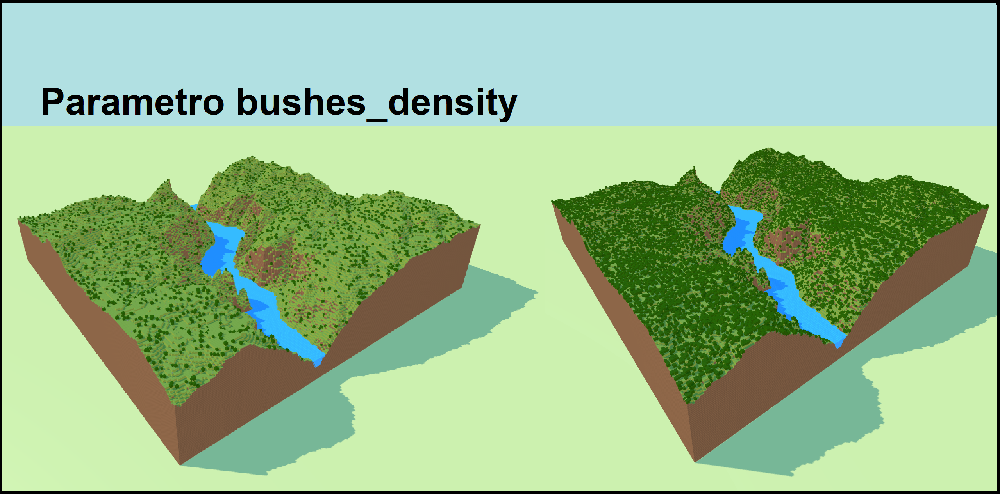
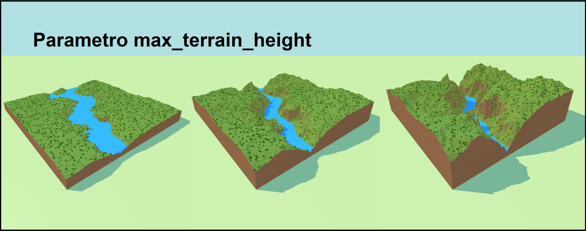
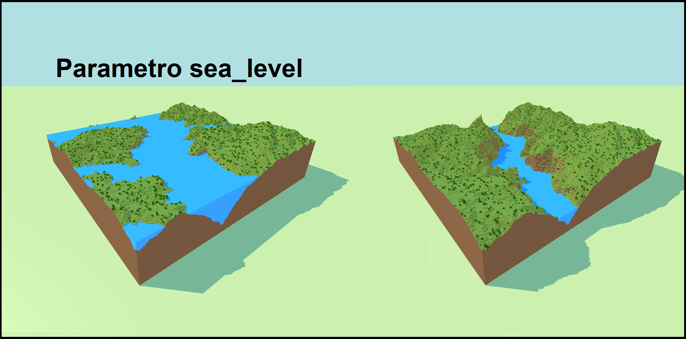

## Screenshoot scenari realizzati
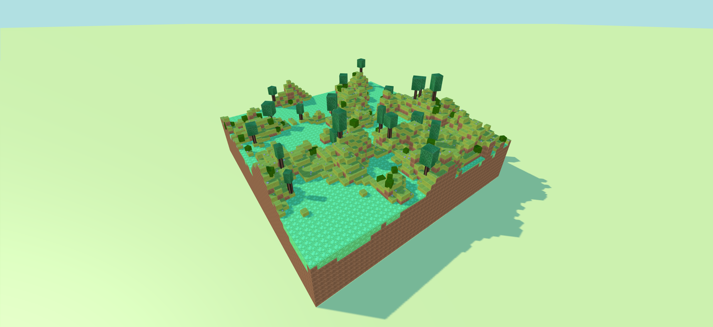
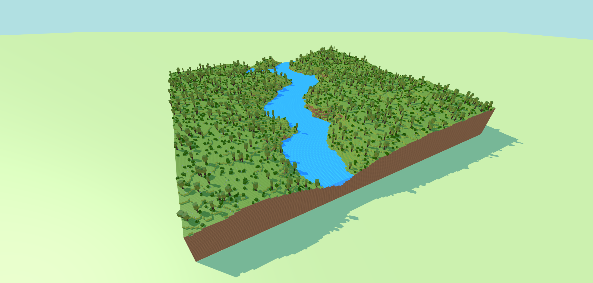
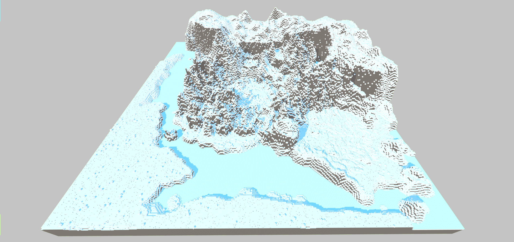

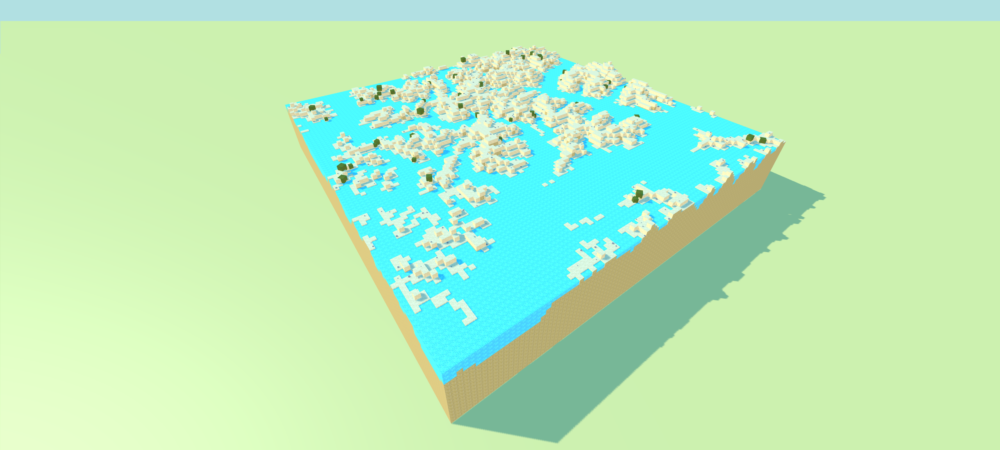
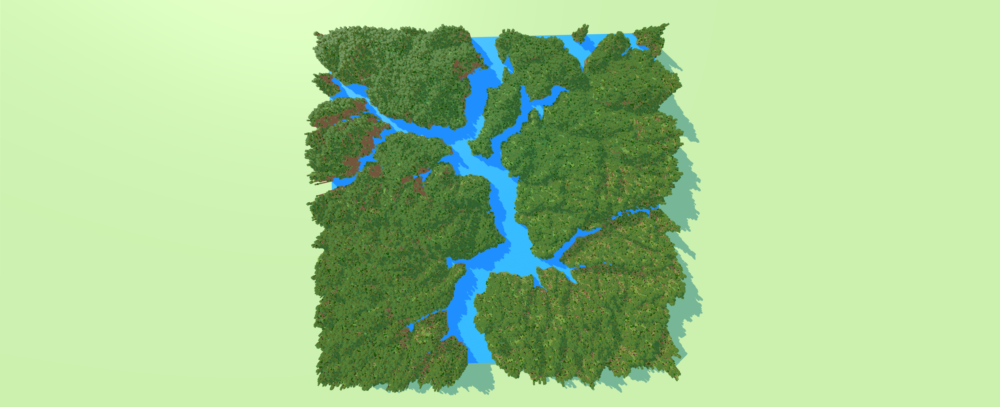
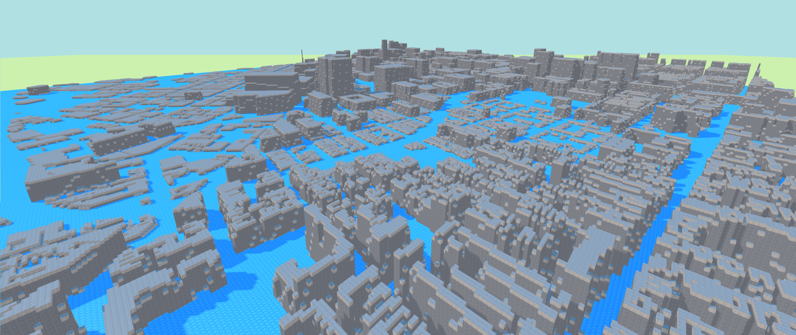
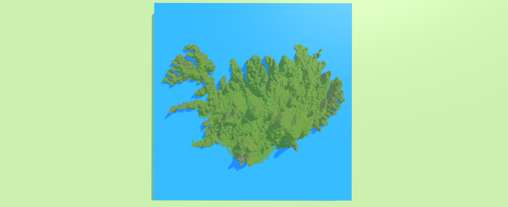
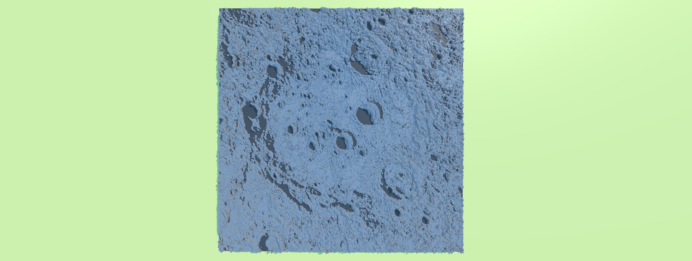
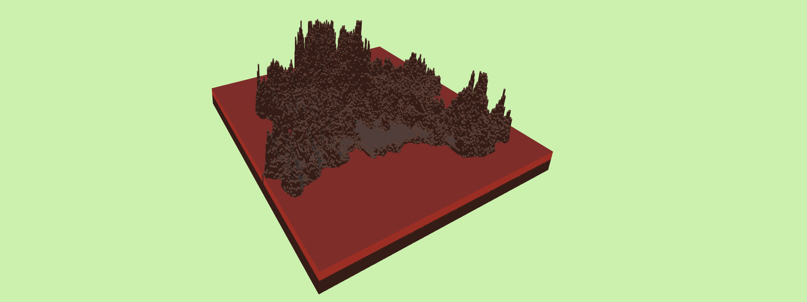
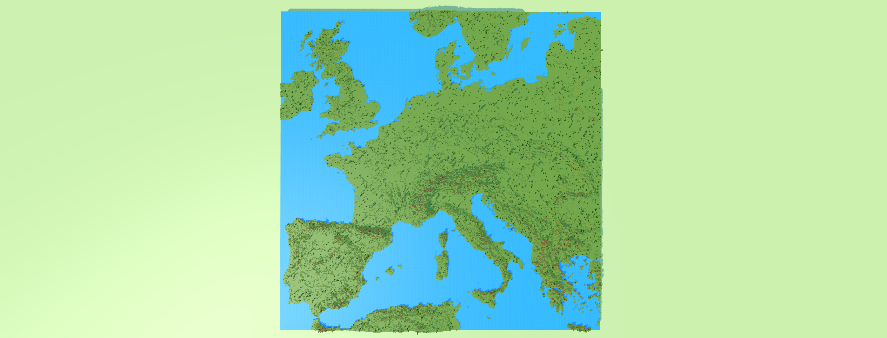
