# Interactive 3D Graphics - Progetto

## 28 Ottobre

### Mansi:
- Visualizzazione della consegna e del codice. Primi test sulla generazione del terreno.
- Sperimentazione del codice *heightmap* - implementazione di un primo prototipo di algoritmo per la generazione di un terreno.

    Primo Prototipo:
    

    Primo Prototipo (vista Wireframe):
    

    Heightmap utilizzata:

    

- Refactoring/riorganizzazione del codice fornito: creazione di funzioni per inizializzare camera,scena renderer, lightsystem.

---
## 29 Ottobre

### Mansi:
- Ulteriori sperimentazioni con l’algoritmo di generazione del terreno.
  - Analisi del primo problema riscontrato: il terreno non risulta uniforme perchè mancano dei cubi a coprire i buchi che si vengono a formare a causa di elevati dislivelli nel terreno.

    Esempio del problema:
  

    Heightmap creata appositamente al fine di accentuare il problema riscontrato:
  
    

  - Prima sperimentazione che tenta di risolvere il problema, soluzione efficacie ma poco efficiente. Alcuni cubi mancanti vengono inseriti più volte portando ad un overhead nella fase geometry.

    Esempio del terreno "fixato".\
    In giallo i cubi aggiunti successivamente alla prima fase di generazione del terreno:
    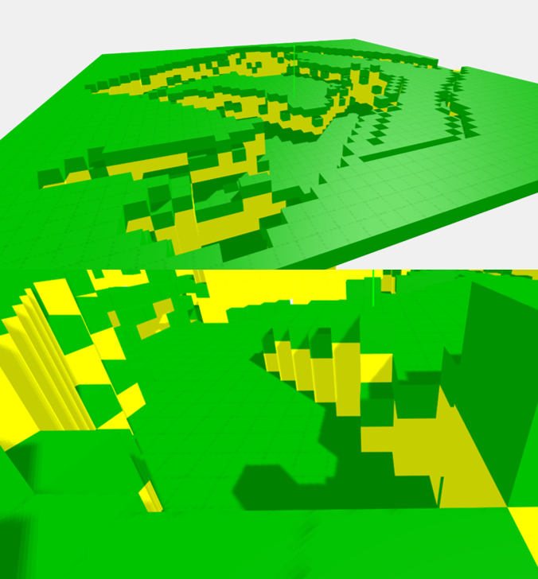

  - Seconda Implementazione che risolve senza overhead la problematica dei dislivelli elevati.

- Pulizia del codice
- Altri problemi riscontrati:
  - Artefatti grafici (ombre) sui “bordi dei cubi”.
  - Basse performance:40-50 fps su una RTX 2070 – i7 9700K.

  Esempio di artefatti grafici sui bordi dei cubi:
    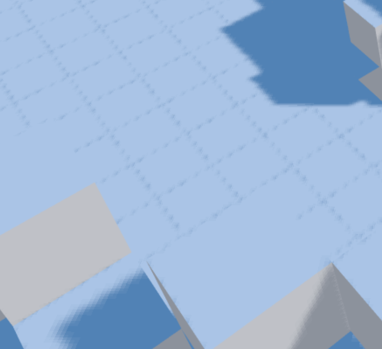

---
## 30 Ottobre

### Meeting di Gruppo

- Progettazione della scena di base e suddivisione dei compiti

Scena di base ideata:
- Sistema di generazione del terreno con:
  - Erba sui blocchi della superficie;
  - Terra sui blocchi sottostanti (visibili dall’esterno)
  - Erba, cespugli e alberi posizionati randomicamente sulla superficie:
    - con animazione
    - interattività con la luce (ombre)
  - Edificio in centro alla scena
    - Con animazione 
  - Animazione della telecamera

Per i primi giorni di lavoro successivi al meeting i compiti sono stati suddivisi nel seguente modo:
- Relazione: Passabì
- Generazione del terreno: Mansi
- Animazioni, modellazione: Passabi
- LightSystem & Visuals: Passabì
- Spawning di oggetti nella scena: Mansi

### Mansi:

- Test con heightmap più complessa -> 100x100=10K cubi = 120K triangoli circa
  - Framerate inaccettabile (10-15 su Intel UHD 620); bisogna valutare possibili ottimizzazioni.
  - Usare dei cubi non è per niente efficiente, la maggior parte delle facce sono inutili, sono nascoste e potrebbero benissimo non essere renderizzate al fine di aumentare di molto le performance
    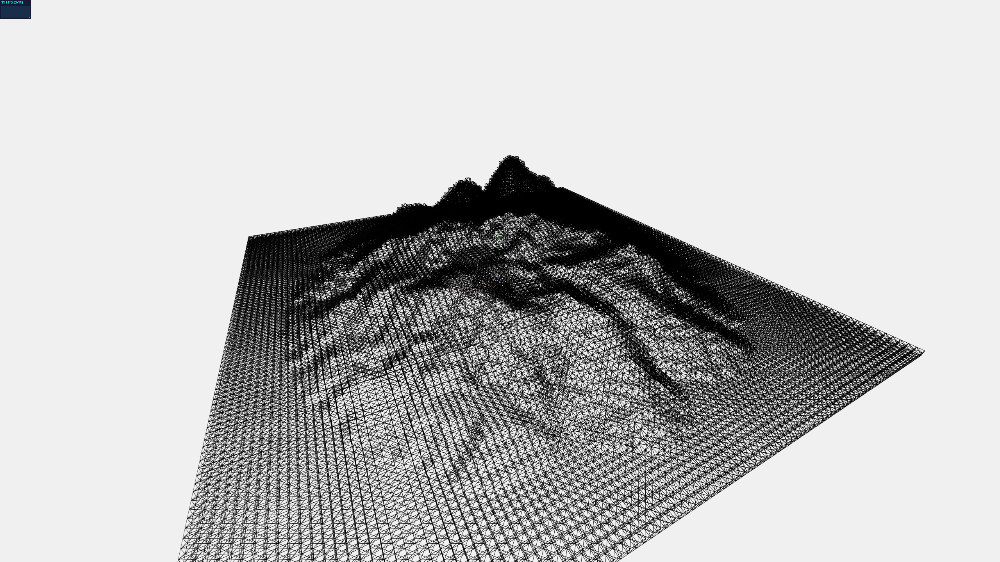

- Obiettivi del giorno: ottimizzazione della generazione del terreno, lato geometry.
  - Soluzione: inizialmente con una heightmap di 100x100 istanziavamo 10K blocchi superficiali nella scena (+ quelli sottostanti nei disliveli), portando ad un elevato overhead nella gestione di un alto numero di mesh. La soluzione attuata unisce i mesh di tutti i cubi in un unico mesh. Il numero di triangoli non cambia, ma WebGl si trova a lavorare con un unico mesh (frutto del merge degli altri). Con la stessa heightmap si è passati a 60FPS dopo questa miglioria.
  - Possibili problemi: Ora abbiamo un unico mesh, non possiamo applicare materiali diversi… Si possono applicare diverse texture a diverse porzioni del mesh? Da sperimentare e verificare se la soluzione utilizzata è valida.
  - Altre considerazioni: L’implementazione più corretta nella generazione del terreno non dovrebbe utilizzare dei cubi ma delle facce, l’attuale implementazione è migliorabile.

- Settato il renderer in high performance.
- Successive modifiche: I cubi della superficie (erba) e quelli sottostati (terra) non vengono più mergiati in un unico mesh ma in 2 mesh seperati, così da poterli trattare separatamente.
  
- Primi test con le texture sulle 2 mesh del terreno:
  

- Vari test di performance su UHD620, Nvidia 940MX, RTX 2070.

### Passabi:

- Prime prove con ThreeJS Editor
  - Creazione gruppi (insieme di più forme)
  - Aggiunta colore
  - Aggiunta texture
  - Trasformazioni

- Modellate le pale del mulino
  - Aggiunta texture
  - Aggiunta rotazione
  - Aggiunta ombre
  - Test su starting code with lights

- Modellata l’erba
  - Ho usato 4 piani incrociati
  - Risolto problema trasparenza non completa (usando test z-alpha)
  - Problema ombra da risolvere

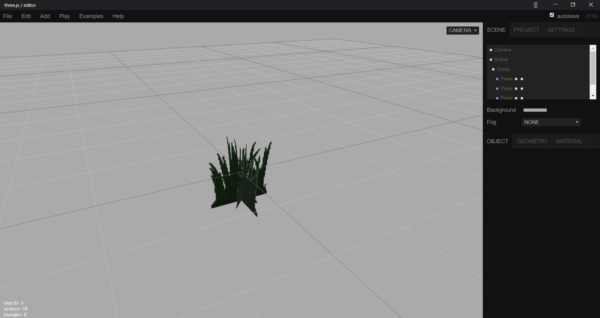

- Inizio modellazione struttura del mulino

---
## 31 Ottobre

### Mansi:
**Obiettivi del giorno**: refactoring e pulizia del codice; creazione di una piccola roadmap per organizzare il lavoro per i giorni successivi. 
- Ordinamento repository.
- Refactoring codice generazione terreno + commento del codice.
- Implementazione e fixing normalizzazione dell’altezza (massimo numero di layer voluti)
- Fixed: I cubi vengono ora automaticamente posizionati al giusto offset dal centro della scena in modo tale che il terreno finale sia perfettamente centrato con (0,0,0).
- Fixed: Le texture sui cubi risultavano con i colori sfalsati -> Bisogna settare il material di colore bianco.
- Creazione di una piccola roadmap/lista di obbiettivi/features:

| n° | Features TODO List | Priorita' |
| :---        |    :----:   |          ---: |
| 1 | Ideazione e implementazione di un sistema di spawning randomico della vegetazione nel terreno della scena. Idee: parametro: densità vegetazione. | Alta |
| 2 | Ottimizzazione complessità del terreno (dal punto di vista geometry): Implementare l’approccio con l’uso delle facce e non dei cubi (rimozione dell’overhead di facce non visualizzate e pertanto inutili). | Media |
| 3 | Ristrutturazione del codice, inserimento di variabili (in futuro modificabili via interfaccia) che permettano di configurare con flessibilità i parametri di generazione del terreno. Es: scelta texture_heightmap, n° di layer, texture per i blocchi superficiali e non superficiali, ... | Media |
| 4 | Idea: Aggiunta di un sistema di generazione di superfici d’acqua. | Bassa |
| 5 | Idea: Aggiunta di un piano “infinito” di altezza 0 su cui “appoggia” il terreno. | Bassa |
| 6 | Ottimizzazione velocità di generazione del terreno. *Come?* | Bassa |
| 7 | La telecamera si posiziona automaticamente in una posizione coerente in base alle dimensioni del terreno generato (si adatta alle varie dimensioni). | Bassa |

- Ideazione dell'algoritmo di spawning randomico della vegetazione.

---
## 1 Novembre

### Mansi:
**Obiettivi del giorno**: Lavorare sull’implementazione dell’algoritmo di generazione della vegetazione.

- Implementazione dell’algoritmo di spawning randomico di vegetazione nel terreno precedentemente generato. L’algoritmo prende in input un valore “grass_density” che va da 0 a 100, ad esempio: con un valore di 25 vengono scelti randomicamente 25% dei cubi della superficie su cui verrà poi istanziato un modello di vegetazione.
  
  Nell’esempio: Circa 6000 modelli di erba istanziati
  

- Problema riscontrato da fixare: L’algoritmo attualmente importa tramite ObjectLoader il file json (in questo esempio il modello dell’erba) e poi si occupa di istanziarlo nel terreno: Questo causa, come riscontrato precedentemente un overhead nella gestione di un elevato numero di oggetti nella scena, abbattendo il framerate drasticamente (15 FPS su una RTX 2070). Precedentemente, con i cubi del terreno il problema è stato risolto eseguendo il merge dei mesh di ciascun cubo in un'unica entità. È necessario effettuare la stessa operazione con i modelli di vegetazione? Come? Effettuare ricerche.
- Implementazione della feature n° 2 -> Ottimizzazione della complessità del terreno: Implementata la generazione che fa uso di facce e non di cubi. L’overhead di facce istanziate e renderizzate inutilmente è stato rimosso causando un enorme vantaggio in termini di performance. Precedentemente si notavano cali di framerate con terreni da 250x250. Con il nuovo approccio è possibile gestire e visualizzare su schermo terreni generati da immagini superiori a 1000x1000. (su una RTX 2070)

  Visione wireframe: è possibile notare come non siano più presenti le facce “nascoste” che precedentemente venivano inserite nella scena inutilmente.
  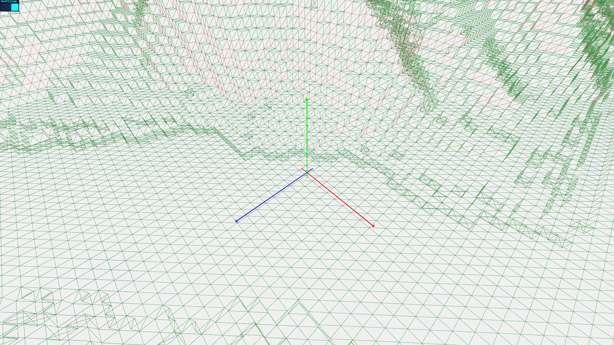
  

### Passabi:
**Obiettivi del giorno**: finire il modello del mulino, implementazione musica, ricerche sulle GUI, relazione in linguaggio markdown ed eventuali altri modelli

- Refactoring codice
  - si erano create delle inconsistenze sul ramo master di GIT, risolte
  - nuova organizzazione cartelle per evitare che il problema si ripresenti

- Aggiunta musica di sottofondo alla scena
  - per ora, si puo' disattivare premendo "s" (= spegni) e riattivare premendo "m" (= musica)
  - TODO: implementare queste funzioni con la GUI (priorita' media)

- Scrittura portfolio in linguaggio MarkDown
  - TODO: finire di inserire le immagini nella directory project_report/img

- Creato modello fungo rosso e grigio + test
  - NB: per le texture abbiamo deciso di usare delle skin gratuite usate per delle mod di Minecraft 
  - TODO: la parte trasparente non dovrebbe fare ombra --> da fixare

- Riscontrato problema sulle pale del mulino
  - Se viene chiamata in Update la rotazione prima che il modello sia caricato al 100% si generano degli errori
  - Risolto con un controllo sul tipo di oggetto prima di effettuare la rotazione

- Completato il modello del mulino

  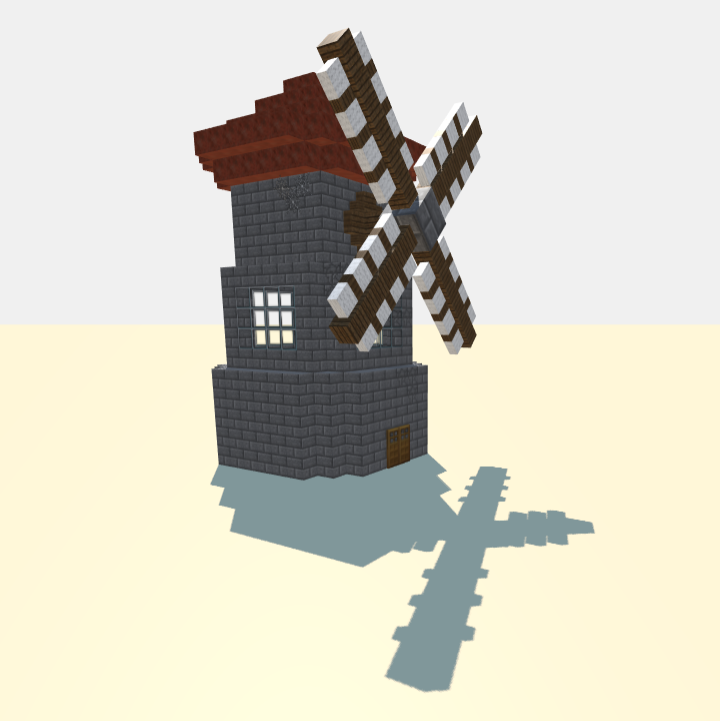
  
---
## 2 Novembre

### Mansi:

- Obiettivi del giorno: analisi del codice, refactoring & ottimizzazione.

  - aggiunta misurazione tempo di generazione del terreno.
  - ottimizzazione fase di generazione del terreno:
    - tramite piccoli accorgimenti sul codice è stato possibile velocizzare la fase di generazione del terreno. Per testare il risultato è stata utilizzata una heightmap di 750x750 la quale è stata generata prima in 14555ms e poi, con le ottimizzazioni effettuate in 8440ms portando a un miglioramento circa pari al 42%.
    Le misurazioni sono frutto della media di diverse misurazioni. (rtx 2070)
  - Eseguito test di performance dopo l'ottimizzazione del codice: utilizzando un'img in input 1250x1250 il codice è riuscito a generare e visualizzare su schermo in 30.5sec un terreno da 1562500 blocchi superficiali (esclusi quelli delle penedenze) portando la CPU (i7 9700K) costantemente al 100%, un utilizzo della GPU di circa 40% (RTX 2070), e un utilizzo di circa 9GB di memoria primaria.
  - I 4 lati agli estremi del terreno ora non sono più "vuoti" ma viene generata una parete in modo da rendere più piacevole la visione del terreno da distanze elevate; è stato inoltre aggiunto un piano su cui poggia il terreno.
  - è stato fixato un problema che generava erroneamente le pendenze/coperture buchi nei blocchi ai bordi del terreno.

Aggiornata la ROADMAP:

| n° | Features TODO List | Priorita' |
| :---        |    :----:   |          ---: |
| 1 | Fixing dell'algoritmo di generazione/spawning della vegetazione nel terreno: Capire come mergiare i mesh e ottimizzare la presenta di un elevato numero di oggetti! | Alta |
| 2 | Idea: Aggiunta di un sistema di generazione di superfici d’acqua. | Bassa |
| 3 | La telecamera si posiziona automaticamente in una posizione coerente in base alle dimensioni del terreno generato (si adatta alle varie dimensioni). | Bassa |

### Passabi:

- Sperimentazioni con luci e ombre
- Riscontrato problema quando vengono cambiate le impostazioni usando la funzione *onDocumentKeyDown*
  - Soluzione: implementare una GUI --> primi test con div HTML e CSS

- Implementazione GUI
  - CSS simile al contatore FPS
  - Implementato il controllo musica ON/OFF
  - Implementata la gestione della qualita della luce direzionale
  - Implementate informazioni sulla mappa e visualizzazione di Heightmap usata

    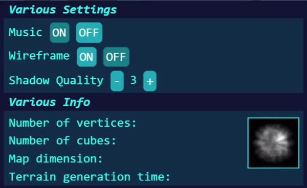
  
- Modellazione alberi
  - modello albero di mele

    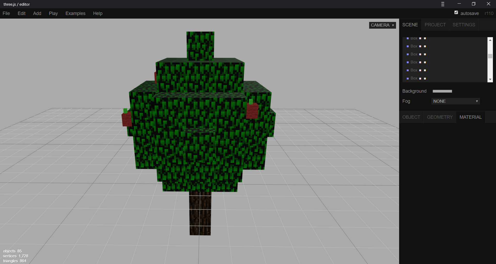

- Creato branch per la modifica di alcuni modelli
  - perfezionato albero di mele (aggiunta trasparenza)
  - modificato il tetto del mulino
  - sistemate alcune ombre non corrette del mulino
  - aggiunte ragnatele al mulino
  - aggiunto albero tipo betulla (versione normale)
  - aggiunto albero tipo betulla (versione autunno)

  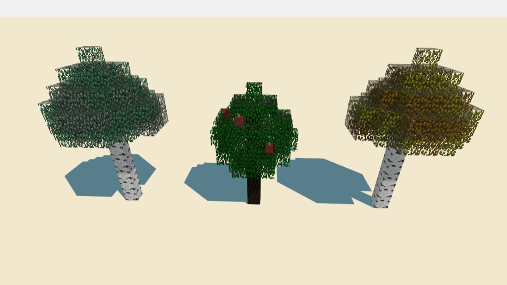

- Idea: personaggio incorporeo (fantastimo) che fluttua sulla mappa e rende possibile visitare il mondo

- Idea: aggiungere occlusione ambientale
  - ricerche
  - primi test su 2 cubi (uno con AO, uno senza)
  - aggiunta dell'AO sul mulino
  - vari test sulle altre impostazioni disponibili in three js editor - fallimentari, nulla di utile al momento

  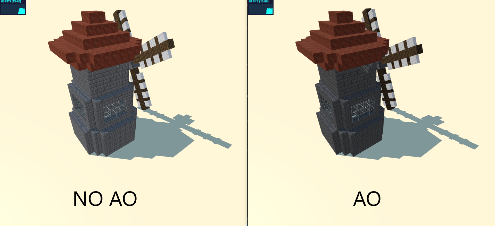

## 3 Novembre

### Mansi:

- Rilettura e piccole sistemazioni del codice.
- Sistemazione di alcune texture.
- Sperimentazioni con l'ottimizzazione degli oggetti caricati tramite ObjectLoader senza alcun risultato.

## 4 Novembre

### Mansi & Passabì:

- Colloquio con il professore a fine lezione relativa alla problematica riscontrata (basse performance con un'alto numero di istanze di oggeti caricati tramite Objectloader).
  - Soluzioni possibili:
    - Eseguire il merge dei vari mesh come effettuato con i cubi(facce) (il mesh del terreno).
    - Condividere geometria e materiale per ciascuna istanza dell'oggeto, al fine di ridurre drasticamente i cambi di contesto effettuati dalla gpu. (in astratto "passare da n oggetti diversi a n istanze di un solo oggetto").

### Mansi:

- Rilettura del codice & aggiornamento del report.
- Aggiornamento della ROADMAP:

| n° | Features TODO List | Priorita' |
| :---        |    :----:   |          ---: |
| 1 | Fixing dell'algoritmo di generazione/spawning della vegetazione nel terreno: Sperimentare le soluzioni proposte precedentemente. | Alta |
| 2 | Introdurre l'entità cespuglio da posizionare randomicamente nella scena (idea: parametro dimensione che varia randomicamente) | Alta |
| 3 | Commentare e fare il refactoring del codice prima della consegna | Obbligatoria |
| 4 | Creazione della scena finale da presentare come lavoro concluso | Obbligatoria | 
| 5 | Valutare come sostituire l'erba billboard non consentita dal progetto in quanto "non fatta a cubi" | Bassa |
| 6 | Aggiunta dell'ambient occlusion | Bassa |
| 7 | Aggiunta di qualche shader? sperimentare ed eventualemte aggiungere dove sensato. | Bassa |
| 8 | Idea: Aggiunta di un sistema di generazione di superfici d’acqua. | Bassa |
| 9 | La telecamera si posiziona automaticamente in una posizione coerente in base alle dimensioni del terreno generato (si adatta alle varie dimensioni). | Bassa |

### Passabi:

- Fix minori codice
- Modifiche alla GUI per quanto riguarda la gestione delle ombre

## 5 Novembre

### Mansi:

- Introdotta l'entità cespuglio e completata l'implementazione della sua generazione e posizionamento randomico nel terreno. (Non si è verificato il problema di performance, i cespugli vengono mergiati in un unico mesh alla fine della loro generazione.) Non sono mesh importate.
- Pulizia e Commento del codice.
- Screenshots, aggiornamento report.

### Passabi:

- Aggiunte immagini al journal/report markdown
- Spostamento journal dal file personale al file condiviso

## 6 Novembre

### Mansi & Passabì:

- Creazione prima scena
  - implementazione GUI
  - aggiunta mulino
  - aggiunti cespugli
  - aggiunti sassi (con fix posizione)
  - modificato il colore del cielo
  - modificato il colore del piano su cui appoggia la scena
  - Varie piccole modifiche e fix del codice.

### Passabi:
- Modifica telecamera: non può più andare sotto il livello del terreno

  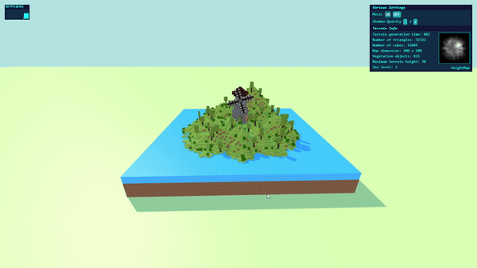

- Modificate texture scena 1 (sostituite con texture realistiche - no cp)
  - Modificata erba
  - Modificate rocce
  - Modificati cespugli
  - Modificato terreno

- Modifiche mulino
  - aggiunta base che non si compenetra con l'erba (problema z-fighting corretto)
  - aggiunto pavimento (visibile attraverso la porta)
  - reskin con texture finali

## 7 Novembre

### Passabì:

- Obiettivo: fixare il problema del lag dovuto dai troppi oggetti a schermo

- Dopo vari test posso affermare che il problema non è la funzione clone(), aggiungere lo stesso numero di oggetti con materiale condiviso non influisce sulle prestazioni, devono essere una mesh unica per far si che il framerate rimanga stabile
- Capito perchè gli oggetti esportati non si univano in un'unica mesh, sono BufferGeometry, non normali Geometry
- Studio BufferGeometry
- Merge degli oggetti importati
  - Nuovo problema: è possibile assegnare un solo materiale!
  - Divido il modello degli alberi in 2: tronco e chioma
  - Il frame rate è migliorato ma comunque non efficiente come il mergeMesh --> usabile con moderazione sulla scena

### Mansi:
- Fixing conto di cubi e poligoni.
- Refactoring completo del codice.
- Implementazione del sistema di generazione dell'acqua.
- Aggiunta dell'entità rocks per la generazione di oggetti randomici su scena.
- Aggiunto un filtro alle posizioni in cui può venir generata vegetazione per accogiere il mulino per la scena da presentare a fine progetto.
- Fixing vari.

## 8 Novembre

### Videocall di gruppo:
- Recap del progetto
- Roadmap step finali
- Ideazione di alcune scene
- Rilettura codice/readme e journal di gruppo
- sistemazione cartelle repository

### Passabì:

- Uniti i log personali in log unico
- Scelta texture per scenari differenti
  - Sabbia
  - Canyon (terra rossastra)

- Aggiunto il loading alla scena
- Aggiunta schermata di caricamento della scena

### Mansi:
- Ideazione e implementazione della generazione randomica di alberi su scena.
- Implementazione di una semplicissima animazione dell'acqua.
- Test di funzionamento del codice.
- Stesura e rilettura di tutta la mia parte del journal.
- Creazione screenshots per il readme.

## 9 Novembre

### Videocall di gruppo:
- Conclusione del progetto
  - revisione README
  - revisione JOURNAL
  - revisione scene

### Passabì:

- Fix Scena Alternativa Luna
- Aggiunte alcune scene
